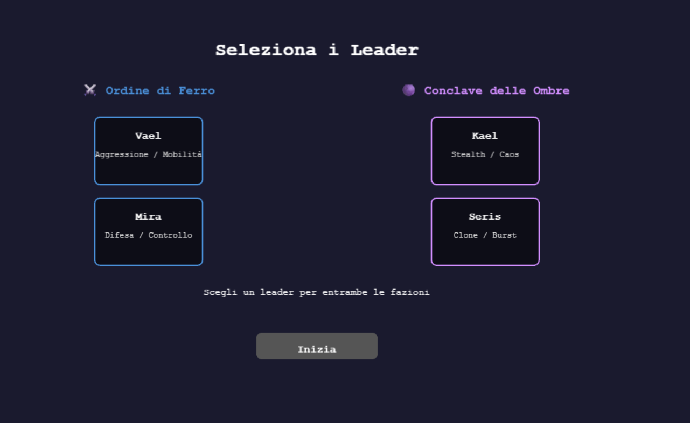
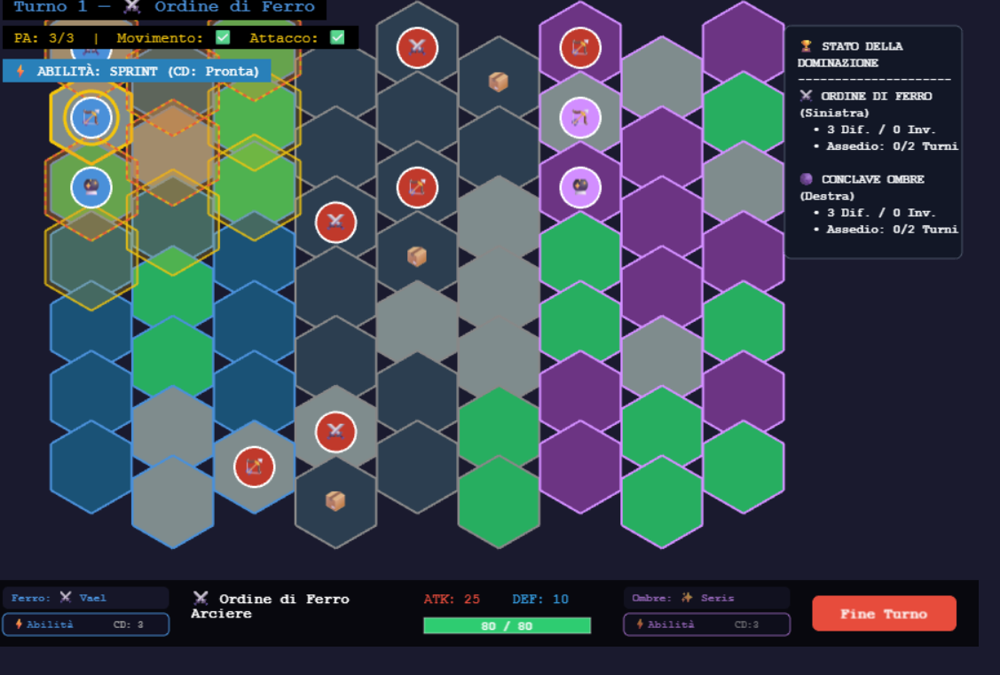
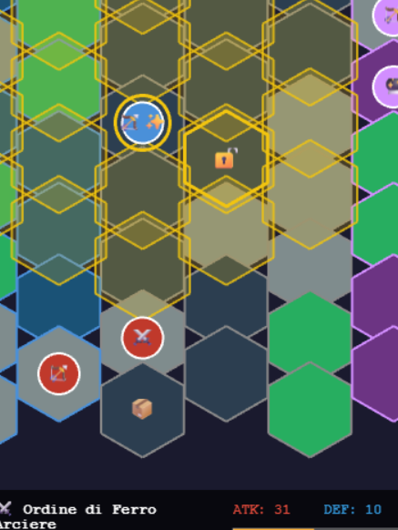
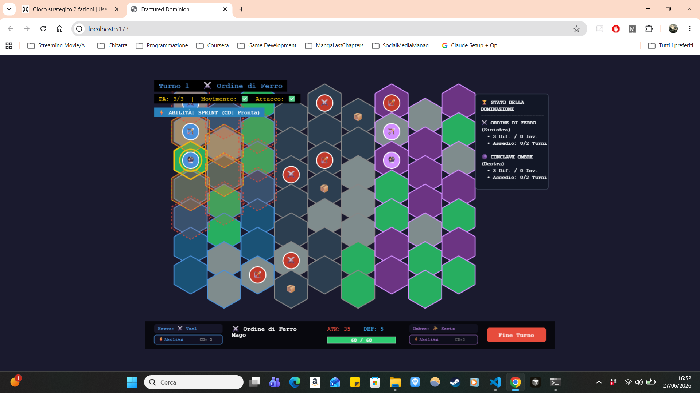
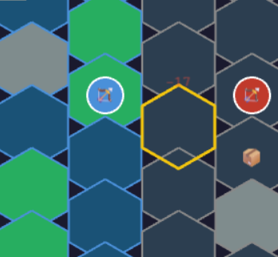
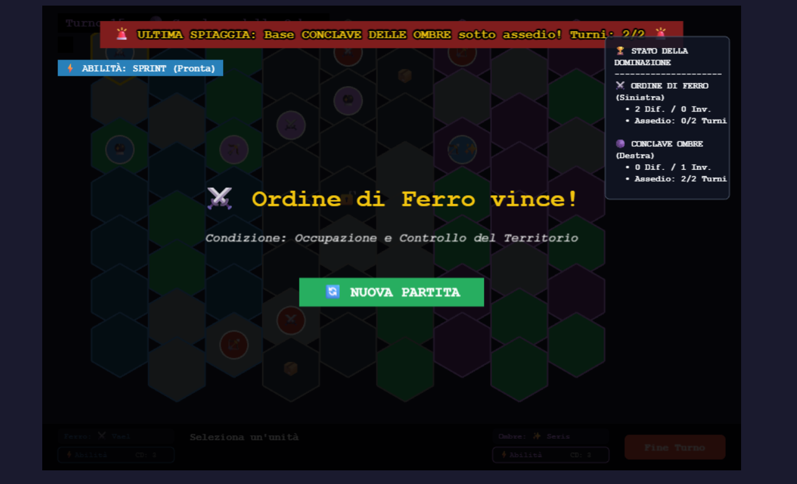

# Fractured Dominion

Fractured Dominion is a browser-based turn-based tactical strategy prototype built as a portfolio project.

Inspired by **Warcraft**, **StarCraft**, **Total War**, and **XCOM**, it combines:
- hex-grid tactical movement,
- faction-based combat,
- terrain modifiers,
- neutral NPC guards,
- legendary treasure objectives,
- multiple win conditions based on elimination and territorial siege.

## Screenshots
### Leader Selection

### Full Gameplay View

### Legendary Treasure Equipped

## Features

- 2 playable factions
- pre-match leader selection with passive bonuses
- Warrior, Archer, and Mage unit archetypes
- melee and ranged combat
- line-of-sight logic for ranged attacks
- terrain-based cover system
- neutral NPCs guarding legendary treasures
- equippable class-based legendary items
- siege-based territorial victory conditions
- HUD, attack overlays, and movement overlays

## Tech Focus

This project was built to demonstrate:
- gameplay programming
- systems design
- turn management
- combat logic
- UI / HUD implementation
- browser-based prototype development

## Status

Playable prototype / vertical slice in active refinement.

## Goal

The goal of Fractured Dominion is to showcase a small but coherent tactical game system with strong portfolio value, focusing on readable gameplay, modular architecture, and strategic depth.

## Additional Screens

### Unit Selected

### Combat in Action

### Victory Screen

